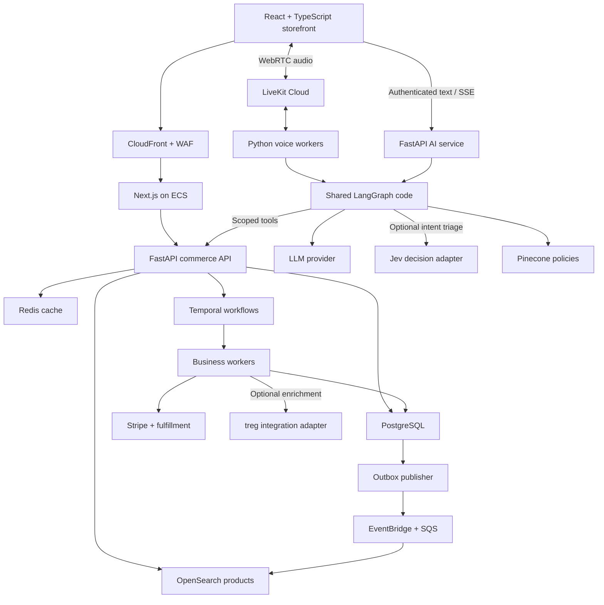
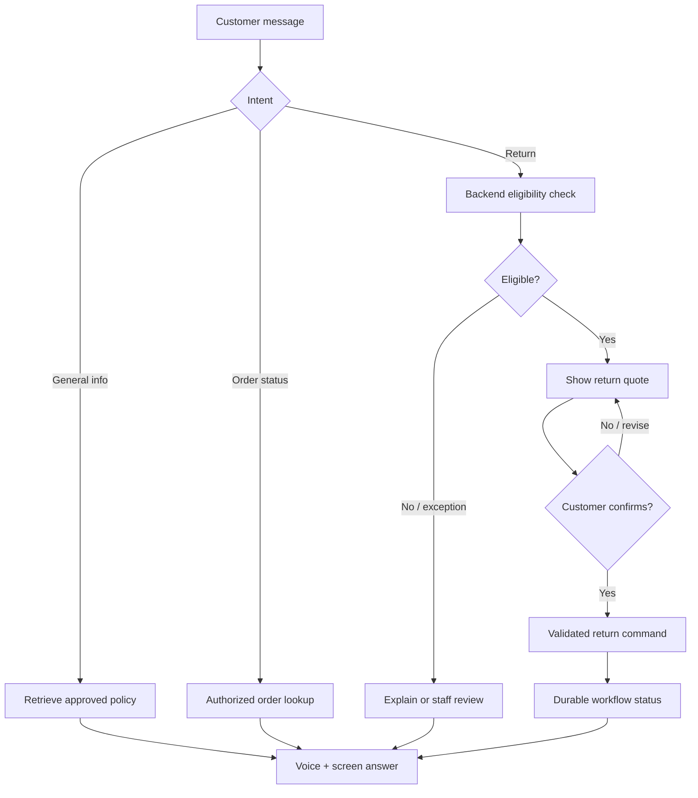

# E-commerce architecture with a voice AI assistant

Research date: September 24, 2026. This is a proposed architecture, not a description of Walmart's internal platform. Product capabilities below are grounded in official documentation; architecture choices, delivery estimates, and targets are engineering recommendations, not benchmark results.

## Decision

Build a React/TypeScript storefront using Next.js, a Python/FastAPI commerce backend, and a separate AI service using LangGraph and LangChain. Use LiveKit Cloud for browser voice transport, Python LiveKit workers for voice sessions, Deepgram Flux for speech recognition, and Cartesia Sonic for spoken responses. Keep order, inventory, eligibility, and refund decisions in deterministic backend code.

This custom-build recommendation assumes the purpose is an AI-centered engineering project with substantial control over backend behavior. If the primary goal is launching a retail business quickly, prefer a commerce platform: Medusa for an open-source starting point or commercetools for a contracted enterprise foundation. Both expose commerce capabilities through APIs. Do not implement two competing order systems. [S11–S13]

## Scope and working assumptions

Launch with a US, English-language, first-party retail store: product discovery, product pages, durable carts, checkout, payment, order tracking, returns, customer support, and an operations console. Include several stock locations in the data model, but initially integrate one fulfillment provider. Defer third-party seller settlements, grocery substitutions, delivery-slot optimization, memberships, and nationwide store integrations.

Illustrative pilot sizing: 100,000 product variants, 100,000 registered shoppers, 500 peak dynamic API requests per second, 20 checkout attempts per second, and 50 simultaneous voice sessions. These are load-test assumptions, not claims about the capacity of a particular instance or about Walmart traffic. Static CDN requests are excluded. Confirm actual traffic, catalogue complexity, budget, supported countries, and fulfillment integrations before provisioning.

Use three separately scaled application areas from the beginning: commerce API, AI/text API, and voice workers. Organize commerce as modules within one deployable service; extract individual services only when workload, ownership, or release independence requires it.

## Recommended stack

| Layer | Recommendation | Purpose and boundary |
|---|---|---|
| Storefront | React + TypeScript + Next.js App Router | Server-rendered product/category pages, browser interaction, account and order pages |
| UI | Tailwind CSS + shadcn/ui | Consistent accessible components; verify keyboard and screen-reader behavior |
| Client state | TanStack Query for interactive server data; local React state for UI | Avoid duplicating Next.js server fetching and client caching for the same data |
| API contract | FastAPI OpenAPI + generated TypeScript client | Share request/response contracts across Python and TypeScript |
| Commerce | Python + FastAPI + Pydantic + SQLAlchemy + Alembic | Typed endpoints, domain rules, transactions, migrations |
| AI orchestration | LangGraph + LangChain | Intent routing, typed tools, retrieval, confirmation and handoff |
| Bounded decision model, optional | TypeSafe Jev behind a server-side decision adapter | Classify support intent and triage ambiguous requests among fixed choices; validate on our data before rollout |
| External data connector, optional | treg behind an allowlisted integration adapter | Pilot supplier/catalog enrichment from approved providers where a direct integration is unavailable |
| Model | Claude Sonnet 5 as an initial candidate through a LangChain provider adapter | Benchmark against a faster model; use task accuracy and latency to select production routing |
| Voice transport | LiveKit Cloud + React client + Python LiveKit Agents workers | WebRTC audio, interruptions, session management |
| Speech recognition | Deepgram Flux | Streaming speech-to-text and turn completion |
| Speech generation | Cartesia Sonic 3.6, pinned production snapshot | Streaming text-to-speech; verify chosen voice and locales |
| Transactional data | Aurora PostgreSQL, or RDS PostgreSQL for a smaller pilot | Orders, cart, inventory reservations, payments, returns, audit records |
| Cache | Managed Redis | Cache only; no authoritative carts, payment state, conversation history, or inventory reservations |
| Product search | Managed OpenSearch | Exact product codes, keyword search, facets, filtering, optional semantic retrieval |
| Policy retrieval | Pinecone | Versioned policy/help documents with metadata filters and citations |
| Durable business workflows | Temporal Cloud + Python workers | Checkout coordination, return labels, warehouse wait states, refund retries |
| Events | Transactional outbox + EventBridge + SQS | Publish committed changes, feed search, notifications, integrations |
| Payments | Stripe hosted payment components + server-side integration | Tokenized payment collection, authorization/capture, refunds |
| Identity | Amazon Cognito using standard OIDC login | Customer identity; enforce resource ownership in backend code |
| Files | S3 + CloudFront | Product media and private, expiring return-label downloads |
| Runtime | ECS Fargate + Application Load Balancer | Run frontend, API, workflow and voice workers independently |
| Telemetry | OpenTelemetry + CloudWatch; LangSmith for AI traces/evals | Trace browser/API/tool/payment operations and AI behavior |
| Delivery | Docker + GitHub Actions + Terraform | Reproducible deployment, staged releases and rollback |
| Validation | pytest, Playwright and k6 | Domain correctness, browser journeys, load and failure testing |

Next.js 16.3 is a verified recent release; use its latest security-patched compatible version at implementation time. Prefer stable functionality; trial opt-in navigation/caching features separately. Vendor documentation confirms LiveKit's Python LangGraph adapter, Flux turn detection, and Sonic 3.6 support. Claude's current model catalogue lists Sonnet 5. These facts establish available candidates, not an independent ranking of every provider. [S1–S5]

## System map

Arrows describe logical access, not every network hop. Public HTTP APIs go through a load balancer, authentication, rate limits, and appropriate edge protection. LiveKit media follows its own WebRTC path; do not send it through the HTTP API load balancer. Voice workers connect to LiveKit and backend services. Temporal workers poll task queues and need no public endpoint.

Share graph definitions and tool contracts as a Python package. Compile the graph inside each voice worker for the LiveKit adapter, and inside the AI service for text. Both use the same durable conversation store with session ownership checks. Serialize turns or apply optimistic concurrency per conversation so a voice turn and text turn cannot race. The documented LiveKit adapter expects a locally compiled graph; it is not a transparent client for an arbitrary remote graph endpoint. [S2]

## Commerce modules and data ownership

| Module | Owns | Correctness rule |
|---|---|---|
| Catalog | Product, Variant, Category, Media | Variant IDs remain stable despite changed names |
| Pricing | Price, Promotion, TaxQuote | Server computes final totals using currency-safe decimal/minor-unit arithmetic |
| Cart | Cart, CartItem | Persist durable carts in PostgreSQL; authenticate merges |
| Inventory | StockLocation, InventoryBalance, Reservation | Atomic availability checks; reservation expiry and oversell protection |
| Checkout | CheckoutAttempt, checkout workflow reference | Repeated submissions resolve to the same attempt |
| Orders | Order, OrderLine, fulfillment status | Store purchase-time price, tax, seller, and policy references |
| Payments | PaymentAttempt, RefundAttempt, provider reference | Unique business keys and reconciliation with provider state |
| Fulfillment | Shipment, Package, TrackingEvent | Track split shipments independently |
| Returns | ReturnRequest, ReturnItem, eligibility quote | Quantity returned/refunded cannot exceed purchased quantity |
| AI support | Conversation, Message, GraphCheckpoint, tool audit | Conversation state cannot authorize a commerce mutation |

Use module-specific database access boundaries even while sharing a database. Give the AI service permission to its conversation/checkpoint schema, not general write permission to order or payment tables. Use separate databases/accounts when operational isolation becomes necessary.

PostgreSQL is the operational source of truth. OpenSearch and Pinecone contain rebuildable projections. Redis contains expendable cache entries. Never use a search result, embedding, stale cache, or LLM-generated number as final checkout or refund truth.

## Checkout reliability

1. Create a checkout attempt with a durable idempotency key and server-calculated totals.
2. Reserve inventory atomically with an expiry. Adding an item to the cart does not reserve stock.
3. Coordinate payment authorization, order confirmation, and fulfillment through a workflow. Choose and document capture timing for the fulfillment/payment method.
4. Persist domain changes and their outgoing event in one PostgreSQL transaction. A separate publisher delivers the outbox event; consumers deduplicate it.
5. Compensate failures: release stock if authorization fails, void authorization if the order cannot proceed, and reconcile ambiguous provider timeouts before retrying.
6. Verify payment webhooks, durably enqueue them before acknowledging receipt, deduplicate deliveries, and handle out-of-order events.

Temporal coordinates retries and waits; it does not make external side effects exactly-once. Each activity requires business-level idempotency. EventBridge routes notifications and SQS buffers consumers; neither replaces the transaction coordinator. Stripe documents duplicated and unordered webhook delivery. [S8–S10]

## Voice user experience

Provide a Talk to AI button beside text chat. Show microphone consent, listening/speaking state, live captions, mute, stop, and a text fallback. Keep order/product cards visible while the assistant speaks. Support interruption and corrections such as, “No, the other headphones.”

The browser obtains a short-lived LiveKit token from an authenticated backend endpoint. Restrict the token to the user's room and participant role. Provider credentials stay in server workers. A voice room identifier alone never grants access to an order.

Recommended audio path: microphone → LiveKit → Flux transcript → LangGraph → answer tokens → Cartesia → LiveKit → speaker. Stream approved response text as it becomes available; avoid waiting for a complete paragraph.

With Flux, use its STT turn completion as the single turn-end authority and LiveKit's voice activity handling for interruption. Do not run competing end-of-turn systems without deliberate integration. Keep speculative/preemptive work read-only: it may warm retrieval but must never start a return or issue a refund. [S3]

When the user interrupts, cancel unneeded speech and generation. Track which words were actually played. Interruption does not roll back a return already committed; retrieve current operation status before explaining what happened. Reconnecting resumes the same conversation and operation IDs.

## Return workflow

Example: “I want to return the headphones I bought last week.”

1. Verify the signed-in session. Guests can receive public help, but must verify their order before accessing personal data.
2. Call `list_my_orders()` using identity injected by backend code. If several items match, display cards and ask the customer to choose.
3. Call `get_return_options(order_id, line_id, quantity, reason)`. Backend rules evaluate delivery date, product category, merchant policy, prior returns, condition, and fraud/manual-review flags.
4. Retrieve policy text for explanation, filtering by market, category, seller, effective dates, and policy version. Use the transaction's applicable policy, including any explicitly defined later exceptions.
5. Show a structured quote: selected item, quantity, expected refund, deductions if any, return method, refund destination, and whether inspection is required. A quote is not a refund.
6. Obtain explicit confirmation tied to that quote. A screen button is the reliable default. Spoken confirmation can be supported with a clear read-back and transaction-bound confirmation state; ambiguous audio asks again.
7. Call `confirm_return(quote_id, confirmation_token, idempotency_key)`. Recheck identity, quote expiry, policy, quantity, and current return state. The token is bound to the authenticated customer and exact quoted terms.
8. Create the return authorization and start a Temporal workflow. Generate the label or supported drop-off instructions and show status on the page. Do not claim success until the backend returns the created record.
9. Wait for the required carrier scan, warehouse inspection, or approved instant-refund rule. Request the refund through a payment worker; follow provider status to completion or failure.
10. Escalate exceptions with a conversation summary, selected order, policy evidence, and attempted operations so staff do not restart the conversation.

Use separate return and refund state machines. For example, a return can be AUTHORIZED → IN_TRANSIT → RECEIVED → INSPECTED → CLOSED, while a linked refund is NOT_REQUESTED → REQUESTED → PENDING → SUCCEEDED or FAILED. A pending refund must not be described as money already received. Stripe documents pending and failed refund states. [S9]

## AI workflow and tool boundary

Start with one controlled LangGraph and three routes, not a collection of autonomous agents. LangChain supplies provider/tool integration. LangGraph stores short-lived conversational decisions and pauses for input; Temporal owns business operations lasting beyond the conversation. Resume graph interrupts through authenticated application code. Side effects must not run again when a graph node replays. [S6–S8]

### Where Jev and treg fit

TypeSafe's **Jev** is an early-access model for bounded, typed decisions. Given a state and predefined answer choices, it returns probabilities rather than conversational text. Use a server-side adapter to test it for high-volume `FAQ | ORDER_STATUS | RETURN | HUMAN_HELP` routing from a voice transcript, and for classifying support-case categories. If the result is ambiguous, the assistant clarifies or passes the turn to the existing LangGraph/LLM route. Jev does not speak, write the answer, access order data on its own, or determine whether a return is allowed. Provider probabilities are uncertain model outputs; measure calibration on real conversations before choosing thresholds. [S21]

**treg** is a gateway/catalog for external provider APIs with server-side credential handling. Pilot it for noncritical enrichment such as importing supplier product attributes from a supported, licensed source, or gathering external catalog data for an operations review queue. Put it behind a narrow backend adapter with explicit endpoint allowlists, spend limits, timeouts, data licensing checks, and a direct-provider fallback. Its catalog is broad, but coverage does not prove that the particular carrier, supplier, or source we need is supported or meets our reliability and data-handling requirements. Our own order, inventory, price, eligibility, Stripe payment/refund, and chosen fulfillment APIs remain direct authoritative integrations. The voice agent does not receive a general-purpose treg token or open-ended MCP access. [S22]

Together, an optional flow is: **voice transcript → Jev intent choice → LangGraph selects an approved action → direct commerce API**. A separate operations flow is: **approved supplier feed via treg → validate/normalize → staff review → catalog import**. No Jev or treg call is required for checkout or refund correctness. Add each only if a measured pilot improves accuracy, speed, integration time, or cost. [S21–S22]

Tools should return typed objects such as `status`, `reason_code`, `amount_minor`, `currency`, `operation_id`, and `evidence`. Examples: `search_products`, `get_product_details`, `get_order_status`, `get_return_options`, `confirm_return`, and `create_support_case`. Do not expose a general database write tool or a free-form `refund(amount)` tool to the model.

Ground general answers in approved help content. Stock, current price, shipping status, and refund status come from live authorized APIs. If sources are missing or conflict, ask a clarifying question or hand off. Citations appear on screen; the voice answer uses a short natural explanation.

## Model and voice choices

| Choice | Strength | Tradeoff | Recommendation |
|---|---|---|---|
| LiveKit + STT + LangGraph + TTS | Explicit transcript, shared text workflow, independent provider replacement | Several latency stages and providers | Initial production candidate |
| Native audio model such as Gemini Live | Direct real-time audio interaction and natural conversation | Separate integration/evaluation; session and tool semantics differ | Benchmark as a challenger |
| Managed end-to-end voice platform | Fast prototyping and fewer components | Less control over workflow integration and portability | Consider for a demo-first schedule |

Native speech-to-speech models still require the same authenticated commerce tools, quote confirmation, and backend rules. Google documents bidirectional Live audio and short-lived tokens for client connections. Transport differs by provider; do not assume every native audio API is WebRTC. [S14]

Evaluate Sonnet 5 as the initial reasoning model, then compare a fast, lower-cost candidate on real return and FAQ tasks. Pin supported model IDs/configuration; inspect current provider availability and retirement policy before deployment. Route to more reasoning only when needed. No vendor documentation alone establishes which model is best for this application's accents, languages, latency, and tool accuracy. [S5]

## Search and retrieval

Use OpenSearch for the product catalogue because exact codes, brands, categories, price filtering, and availability filters are first-class shopping needs. Add semantic retrieval for requests such as “waterproof shoes for a rainy commute.” Merge/rank the candidates and revalidate current commercial facts at purchase time. Walmart's published research describes a hybrid keyword/neural retrieval approach; it supports this design direction without implying that our stack is Walmart's stack. [S15–S16]

Pinecone holds approved policy/help text and its embeddings. Ingest from an authoritative content source, preserve document/section IDs and effective dates, and support update/deletion propagation. Filter before retrieval, rerank a small candidate set when it improves evaluated quality, and cite the source. Track freshness. Do not embed every customer's order history as the main lookup method. [S17]

For a smaller first release, consolidating help retrieval into OpenSearch or PostgreSQL vector search may reduce operations. The proposed separate Pinecone service is justified when policy retrieval needs independent tuning and ownership. Algolia is a managed alternative to OpenSearch if fast merchandising setup matters more than direct search-engine control. [S18]

## Guardrails and privacy at the relevant boundaries

- Authorization: derive customer identity from the session; check order ownership for every tool request.
- Action guardrails: allowlisted tools, validated arguments, confirmation tokens, business rules, and idempotency.
- Retrieval guardrails: treat retrieved documents and product descriptions as data, never higher-priority instructions.
- Payment boundary: collect payment details through the payment provider UI; keep raw card details out of voice and LLM context.
- PII: minimize fields sent to the model, redact logs/traces, apply retention and access controls, and keep raw audio recording off unless intentionally enabled with consent.
- Handoff: support staff review for disputed eligibility, unclear identity, repeated tool failures, or user request.

Critical refund amounts and operation status should use structured backend fields in screen cards and spoken templates. Generic output filtering cannot replace transaction validation. Keep browsing, checkout, and manual returns usable during an AI outage.

## Performance, evaluation, and resilience

Proposed pilot targets, to be verified under realistic load:

| Metric | Initial target | Measurement |
|---|---|---|
| Product search | p95 under 300 ms | Search API latency at the service boundary |
| Product page experience | p75 LCP under 2.5 seconds | Real browser field telemetry by device/network |
| Ordinary voice answer | p50 under 1 second; p95 under 2 seconds | End of user speech to first meaningful audio, excluding tool-heavy turns |
| Tool-assisted voice answer | p95 under 4 seconds when upstreams are healthy | End of speech to substantive answer; report acknowledgments separately |
| Interruption | p95 playback stop under 300 ms | Speech onset to halted assistant playback |
| Commerce availability | 99.9% pilot service objective | Defined good requests divided by eligible requests |
| Transaction correctness | Zero unauthorized/duplicate refunds in release tests | Dedicated adversarial, retry, concurrency and reconciliation tests |

Track success by complete task resolution, correct item selection, policy accuracy, mistaken confirmations, handoff rate, customer satisfaction, and cost per resolved conversation. Run at least 200 curated scenarios initially, with noise, accents, pauses, product-name errors, expired policies, mixed carts, duplicate clicks, disconnected voice, repeated webhooks and provider timeouts. Sample production outcomes with privacy controls. No percentage target is a substitute for production monitoring.

Keep API/database/model regions close. Warm voice capacity, pool outbound connections, stream answers, and avoid unnecessary serial model calls. Set tool timeouts and cancellation handling. Load-test database pools and reservations as well as HTTP throughput. Voice concurrency needs separate admission limits, provider quotas and scaling metrics.

Use multiple availability zones, backups, restore drills, dead-letter queues, reconciliation jobs, and graceful worker draining. Set separate recovery objectives for payments/orders and rebuildable search indexes. At larger geographical scale, Aurora Global Database provides a primary write region and secondary read regions; it is not unrestricted active-active writing. Test failover and possible replication lag. [S19–S20]

## What to adopt now and what to defer

Adopt current stable React/Next.js, streaming voice, semantic turn detection, durable workflows, and hybrid retrieval where measured value is clear. Use a feature flag for native-audio trials and optional navigation optimizations. MCP is useful later when the same tools must be shared across independent clients; direct typed tool calls are sufficient initially. Browser automation should not be the normal way to perform your own returns when an internal API is available.

Defer Kubernetes, a large multi-agent organization, graph databases, model fine-tuning, and Kafka until a concrete requirement justifies them. If replayable, high-volume event streams become necessary, evaluate Kafka/MSK separately from the initial EventBridge/SQS design. Do not operate both by default.

## Delivery sequence

Illustrative 10–14 week pilot with 3–5 experienced engineers and available design/product/QA support; custom integrations and production assurance can extend this. A solo developer's prototype is feasible, but this schedule is not a promise for a full production retailer.

| Stage | Approximate time | Exit condition |
|---|---|---|
| Scope and technical spike | Weeks 1–2 | Choose build/platform path; test voice latency; define policy and order contracts |
| Commerce foundation | Weeks 3–5 | Browse → cart → paid sandbox order → tracking; operations console |
| Reliable returns and text assistant | Weeks 6–8 | Rule-based eligibility, confirmation, durable workflow, retrieval, staff handoff |
| Voice integration | Weeks 9–10 | Captions, interruption, shared conversation, reconnection, return cards |
| Pilot hardening | Weeks 11–14 | Load/failure tests, accessibility, security checks, eval gates and limited rollout |

After the purchase-and-return slice works, run two small optional spikes: compare Jev routing with the current LangGraph/LLM router on the same labeled transcripts, including low-confidence and noisy speech; and test one licensed external feed through treg against a direct integration. Include total latency, error rate, cost, and operational burden. Do not make either a pilot dependency.

Build the first complete vertical slice around a single product purchase followed by a voice-assisted return. Expand product breadth after the payment/return state transitions are reliable.

## Cost model and remaining decisions

Estimate monthly fixed infrastructure plus usage: databases/search + ECS capacity + observability + voice session minutes + speech recognition + speech generation + LLM tokens + workflow/events + network transfer. Check whether LiveKit inference bundles provider billing before adding separate provider charges. Track cost per successfully resolved request, not only token price. Payment processing and shipping labels are separate business costs.

Obtain traffic and session-duration assumptions before giving a meaningful budget. Validate candidate providers with the same audio recordings and task suite. The key remaining decisions are: engineering project versus retail launch; budget and team size; target languages; first-party versus marketplace; number of fulfillment locations; and return/refund policy ownership.

## Primary sources

All accessed September 24, 2026. Sources document capabilities; the recommendations and design targets above are this plan's synthesis.

- S1: [Next.js 16.3 release](https://nextjs.org/blog/next-16-3)
- S2: [LiveKit LangChain/LangGraph integration](https://docs.livekit.io/agents/models/llm/langchain/)
- S3: [LiveKit Deepgram integration and Flux turn handling](https://docs.livekit.io/agents/models/stt/deepgram/)
- S4: [Cartesia 2026 changelog](https://docs.cartesia.ai/changelog/2026) and [LiveKit Cartesia integration](https://docs.livekit.io/agents/models/tts/cartesia/)
- S5: [Claude model overview](https://platform.claude.com/docs/en/models/overview)
- S6: [LangGraph persistence](https://docs.langchain.com/oss/python/langgraph/persistence)
- S7: [LangGraph interrupts](https://docs.langchain.com/oss/python/langgraph/interrupts)
- S8: [Temporal documentation](https://docs.temporal.io/)
- S9: [Stripe refunds](https://docs.stripe.com/refunds)
- S10: [Stripe webhook behavior](https://docs.stripe.com/webhooks), [idempotent requests](https://docs.stripe.com/api/idempotent_requests), and [AWS transactional outbox pattern](https://docs.aws.amazon.com/prescriptive-guidance/latest/cloud-design-patterns/transactional-outbox.html)
- S11: [Medusa architecture](https://docs.medusajs.com/learn/introduction/architecture)
- S12: [Medusa commerce modules](https://docs.medusajs.com/resources/commerce-modules)
- S13: [commercetools documentation](https://docs.commercetools.com/docs)
- S14: [Gemini Live capabilities](https://ai.google.dev/gemini-api/docs/live-api/capabilities) and [ephemeral tokens](https://ai.google.dev/gemini-api/docs/live-api/ephemeral-tokens)
- S15: [OpenSearch hybrid search](https://docs.opensearch.org/latest/vector-search/ai-search/hybrid-search/index/)
- S16: [Semantic Retrieval at Walmart, research paper](https://arxiv.org/abs/2412.04637)
- S17: [Pinecone hybrid search](https://docs.pinecone.io/guides/search/hybrid-search)
- S18: [Algolia NeuralSearch](https://www.algolia.com/doc/guides/ai-relevance/neuralsearch/get-started)
- S19: [ECS load balancing](https://docs.aws.amazon.com/AmazonECS/latest/developerguide/service-load-balancing.html)
- S20: [Aurora Global Database](https://docs.aws.amazon.com/AmazonRDS/latest/AuroraUserGuide/aurora-global-database.html)
- S21: [TypeSafe AI introduction to Jev](https://typesafe.ai/blog/introducing-system-one-models-and-jev) and [TypeSafe AI documentation](https://docs.typesafe.ai/)
- S22: [treg API reference](https://treg.to/docs)
